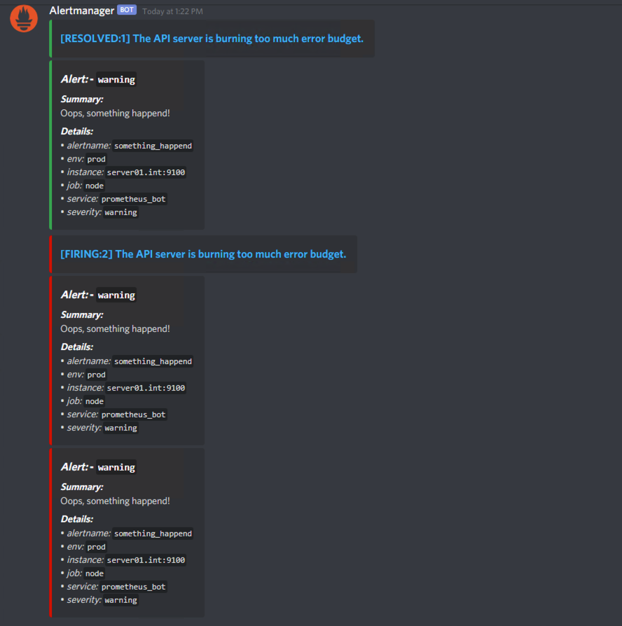

Alertmanager Discord Webhook
===

[](https://hub.docker.com/r/rogerrum/alertmanager-discord/tags)

Give this a webhook (with the DISCORD_WEBHOOK environment variable) and point it as a webhook on alertmanager, and it will post your alerts into a discord channel for you as they trigger:



## Warning

This program is not a replacement to alertmanager, it accepts webhooks from alertmanager, not prometheus.

The standard "dataflow" should be:

```
Prometheus -------------> alertmanager -------------------> alertmanager-discord

alerting:                 receivers:                         
  alertmanagers:          - name: 'discord_webhook'         environment:
  - static_configs:         webhook_configs:                   - DISCORD_WEBHOOK=https://discordapp.com/api/we...
    - targets:              - url: 'http://localhost:9094'     - DISCORD_USERNAME=<override username if needed>
       - 127.0.0.1:9093                                        - DISCORD_AVATAR_URL=<override avatar url if needed>


```

## Example alertmanager config:

```
global:
  # The smarthost and SMTP sender used for mail notifications.
  smtp_smarthost: 'localhost:25'
  smtp_from: 'alertmanager@example.org'
  smtp_auth_username: 'alertmanager'
  smtp_auth_password: 'password'

# The directory from which notification templates are read.
templates: 
- '/etc/alertmanager/template/*.tmpl'

# The root route on which each incoming alert enters.
route:
  group_by: ['alertname']
  group_wait: 20s
  group_interval: 5m
  repeat_interval: 3h 
  receiver: discord_webhook

receivers:
- name: 'discord_webhook'
  webhook_configs:
  - url: 'http://localhost:9094'
```

## Docker

If you run a fancy docker/k8s infra, you can find the docker hub repo here: https://hub.docker.com/r/rogerrum/alertmanager-discord/

## Inspired by

* https://github.com/benjojo/alertmanager-discord
